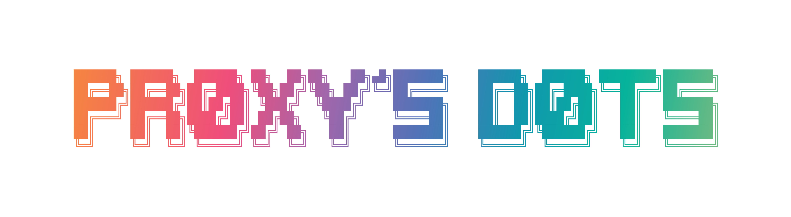

<h1 align="center">
  <a href='#'></a>
  <a href='#'></a>
  <br>
  <br>
  <div>
    <a href="https://github.com/PROxZIMA/.dotfiles/issues">
        
    </a>
    <a href="https://github.com/PROxZIMA/.dotfiles/stargazers">
        
    </a>
    <a href="https://github.com/PROxZIMA/.dotfiles/">
        
    </a>
    <a href="https://github.com/PROxZIMA/.dotfiles/blob/master/LICENSE">
        
    </a>
    <br>
  </div>
</h1>
<br>


 


<h1></h1>

### More Wallpapers
[](https://photos.app.goo.gl/h7EE46K7qDgLpQUv9)


<div align="center">

## Installation
</div>

<details>
<summary><h3>Dependencies</h3></summary>

- Using <kbd>paru</kbd>
    ```sh
    yay -S base-devel pokemon-colorscripts-git hyprland hyprpicker hyprlock hypridle xdg-desktop-portal-hyprland-git waybar-hyprland cava kitty wofi starship wl-clipboard swww swaync tty-clock-git playerctl pavucontrol btop mpd mpd-mpris mpv mpv-mpris qt5-base qt5-wayland qt6-base qt6-wayland lsd geany bat cliphist gamemode polkit-gnome g4music wlogout visual-studio-code-bin boo-grub-git sddm-git boo-sddm-git proxzima-plymouth-git yad blueman network-manager-applet libinput-gestures light waypaper grim slurp swappy rofi nwg-look --needed
    ```

- See https://wiki.hyprland.org/Useful-Utilities/Hyprland-desktop-portal/#installing
    ```sh
    yay -R xdg-desktop-portal-wlr
    ```

- Extra dependencies (not necessary)
    ```sh
    yay -S system76-power obs-studio wlrobs-hg v4l2loopback-dkms v4l2loopback-utils v4l-utils waydroid binder_linux-dkms chromium-wayland-vaapi qalculate-gtk qimgv-light rlr-git uget libreoffice-fresh nemo bulky --needed
    ```

- [<kbd>Chaotic-AUR</kbd>](https://aur.chaotic.cx/) :: Automated building repo for AUR packages 👨🏻‍💻

- [<kbd>Nvidia | Hyprland</kbd>](https://wiki.hyprland.org/Nvidia/) :: Personally did not face any issues with nvidia

> **Note**
>
> Go through the packages once, before blindly installing them.

</details>

<details>
<summary><h3>GTK Theme, Icons, Cursors</h3></summary>

- <kbd>GTK Theme</kbd> :: [<kbd>Tokyonight-Dark-BL-LB</kbd>](https://github.com/Fausto-Korpsvart/Tokyo-Night-GTK-Theme)
    ```sh
    cd ~/Downloads
    git clone https://github.com/Fausto-Korpsvart/Tokyo-Night-GTK-Theme.git
    cd Tokyo-Night-GTK-Theme/
    sudo cp -r themes/Tokyonight-Dark-BL-LB /usr/share/themes/
    ```

- <kbd>Icons</kbd>:: [<kbd>Tokyonight-Moon</kbd>](https://github.com/Fausto-Korpsvart/Tokyo-Night-GTK-Theme)
    ```sh
    cd ~/Downloads
    git clone https://github.com/Fausto-Korpsvart/Tokyo-Night-GTK-Theme.git
    cd Tokyo-Night-GTK-Theme/
    sudo cp -r icons/Tokyonight-Moon /usr/share/icons/
    ```

- <kbd>Cursors</kbd> :: [<kbd>Sweet-cursors</kbd>](https://github.com/EliverLara/Sweet/tree/nova/kde/cursors)
    ```sh
    cd ~/Downloads
    git clone https://github.com/EliverLara/Sweet.git -b nova
    cd Sweet/
    sudo cp -r kde/cursors/Sweet-cursors /usr/share/icons/
    ```

- <kbd>GRUB</kbd> :: [<kbd>PROxZIMA/boo-grub</kbd>](https://github.com/PROxZIMA/boo-grub)
- <kbd>Plymouth</kbd> :: [<kbd>PROxZIMA/proxzima-plymouth</kbd>](https://github.com/PROxZIMA/proxzima-plymouth)
- <kbd>SDDM</kbd> :: [<kbd>PROxZIMA/boo-sddm</kbd>](https://github.com/PROxZIMA/boo-sddm)
</details>

<details>
<summary><h3>Dotfiles</h3></summary>

```sh
cd ~/Downloads
git clone https://github.com/PROxZIMA/.dotfiles.git
cd .dotfiles
cp -r .config .icons .local .mpd .ncmpcpp .scripts ~/
cp .face .fonts.conf .dmrc .gtkrc-2.0 ~/
cp -r Pictures/wallpapers ~/
chmod -R +x ~/.scripts/
chmod +x ~/.config/hypr/autostart
chmod -R +x ~/.config/wlogout/
```

> **Warning**
>
> Again, do not, I said DO NOT blindly run this. Backup your dots beforehand.<br>These commands are well suited for freshly installed systems.

</details>

<details>
<summary><h3>Extras</h3></summary>

#### Vscode
- Theme :: [<kbd>Sweet Dracula</kbd>](https://marketplace.visualstudio.com/items?itemName=PROxZIMA.sweetdracula)
- Extension :: [<kbd>Fix VSCode Checksums</kbd>](https://marketplace.visualstudio.com/items?itemName=lehni.vscode-fix-checksums)
- [<kbd>.dotfiles/.config/Code/User/vsc.css</kbd>](.config/Code/User/vsc.css) is a special CSS file that I use to modify vscode's UI (Vscode's core file is edited so follow the steps with care).
    ```sh
    $ # In VSCode: Help > Toggle Developer Tools
    $ # Copy window.location.pathname.replace(/\/[^\/]+$/, '')
    $ resPrefix=/above/copied/path
    $ # Symlink required files in the above folder.
    $ ln -s '/full/path/to/.dotfiles/.config/Code/User/vsc.css' $resPrefix
    $ ln -s '/full/path/to/.dotfiles/.icons/default/vsc/' $resPrefix
    ```
  - Open <kbd>$resPrefix/workbench.html</kbd> and add `<link rel="stylesheet" href='vsc.css'>` inside the `<head>` tag.
    ```sh
    $ sed -i 's;</head>;<link rel="stylesheet" href="vsc.css"></head>;g' $resPrefix/workbench.html
    ```
  - Restart Vscode. Open the command palette and execute <kbd>Fix Checksums: Apply</kbd>. Restart again.
    - Perform the above 2 steps every time Vscode is updated.
- ***Voilà !!!***
- If you don't want to touch the core file (which is not a big deal) you can use [<kbd>Customize UI</kbd>](https://marketplace.visualstudio.com/items?itemName=iocave.customize-ui).
  - This method may/may not work as extensions can't be guaranteed to always work.
  - All required settings are present in <kbd>settings.json</kbd>.
Use the following command to convert your <kbd>CSS</kbd> file to <kbd>Customize UI</kbd>'s json object.
    ```sh
    $ sed -ze 's/\n/ /g' -Ee 's,/\*[^*]*\*+([^/*][^*]*\*+)*/,,g' -Ee 's/ {2,}//g' -Ee 's/\}([^\{]*) \{/", "\1": "/g' -e 's/:root \{/{":root": "/g' vsc.css
    <kbd></kbd>`

#### Firefox
- Theme :: [<kbd>PROxZIMA/Sweet-Pop</kbd>](https://github.com/PROxZIMA/Sweet-Pop/)

#### Neovim ❤️
- Setup :: [<kbd>NvChad</kbd>](https://github.com/NvChad/NvChad)
- GUI :: [<kbd>Neovide</kbd>](https://github.com/neovide/neovide)
- Configs :: [<kbd>.dotfiles/.config/nvim</kbd>](.config/nvim/)

</details>


<h1></h1>

<details>
<summary><h3>Credits</h3></summary>

_© [r/unixporn](https://www.reddit.com/r/unixporn)_

_© All the maintainers and the artists <3_

_© [flick0](https://github.com/flick0/dotfiles/tree/aurora) © [Syndrizzle](https://github.com/syndrizzle/hotfiles/tree/bspwm) © [NvChad](https://github.com/NvChad) © [adi1090x](https://github.com/adi1090x)_

</details>


<div align="center">

*Sooo that's it for now. See ya!!!*

***ARIGATOU ❤️***
</div>
